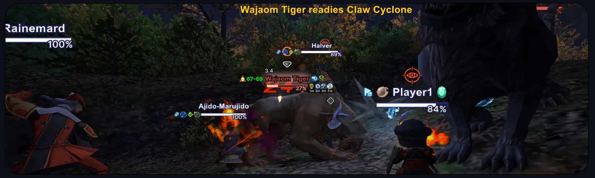
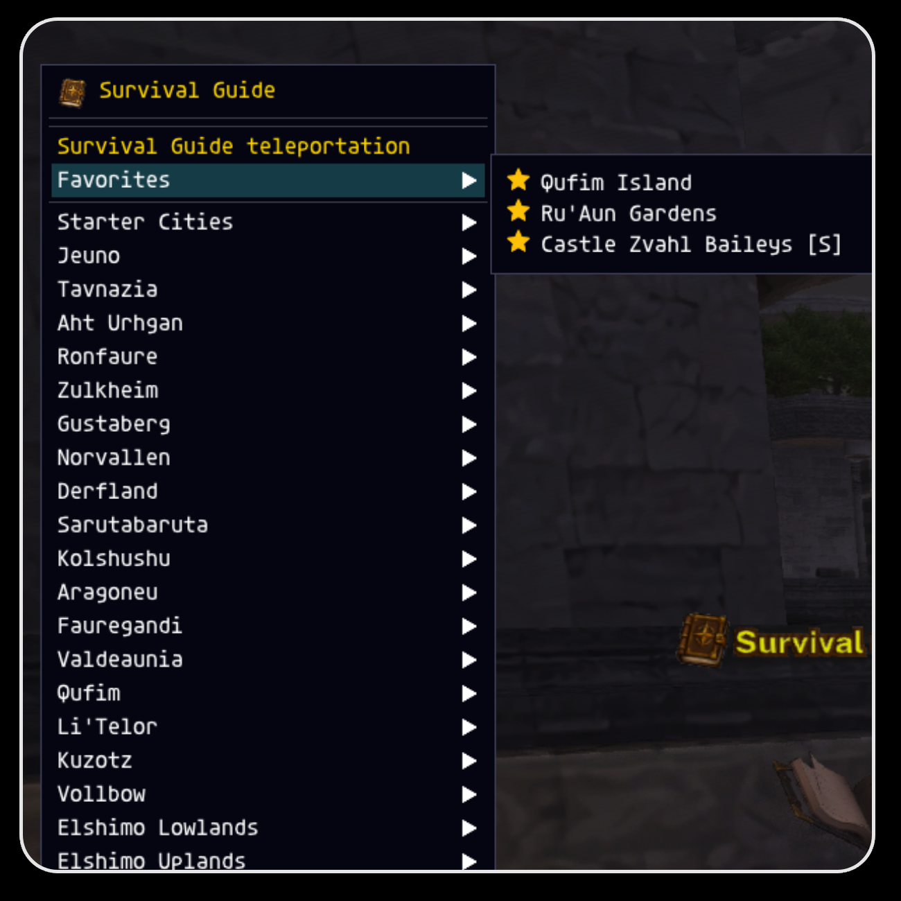
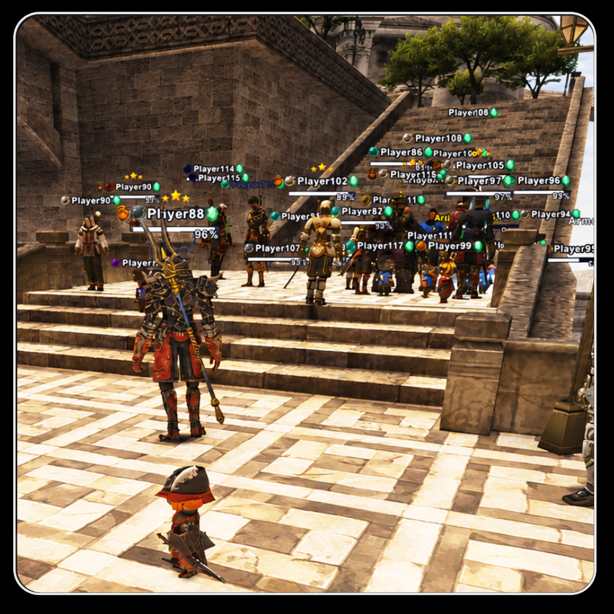
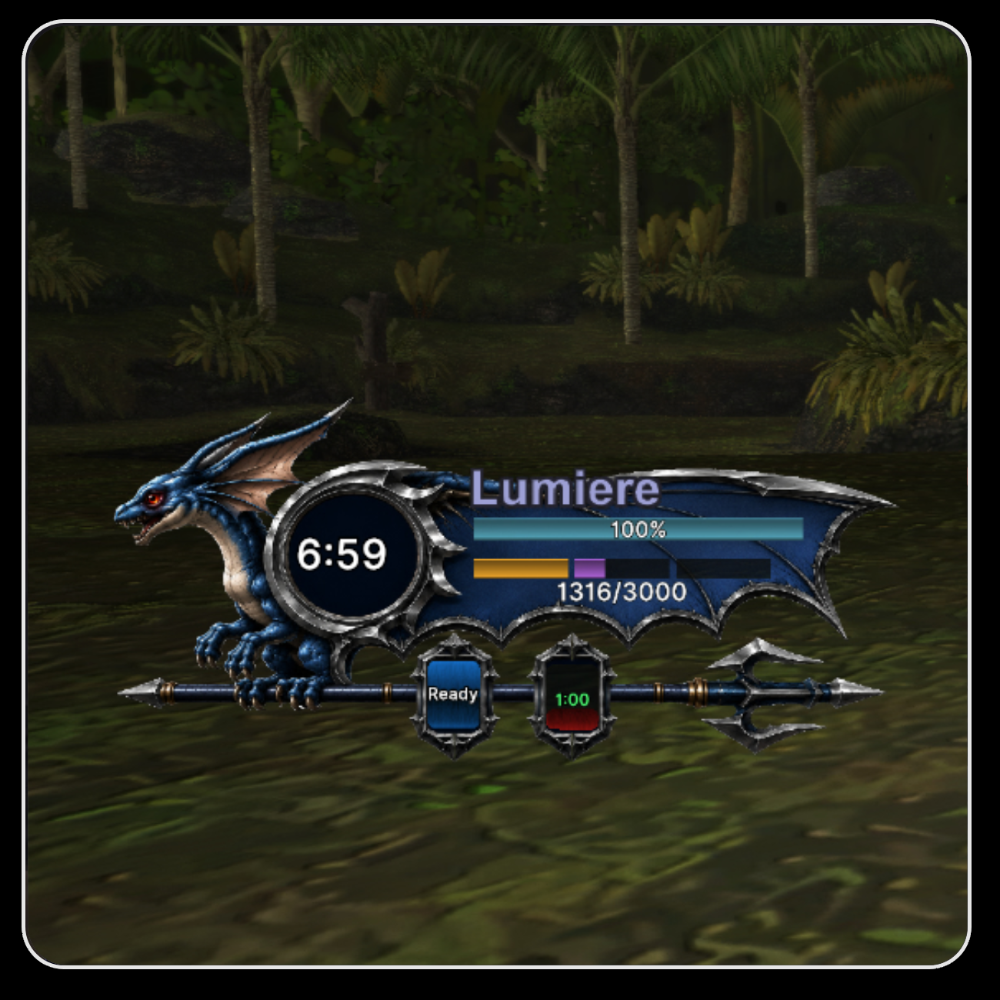
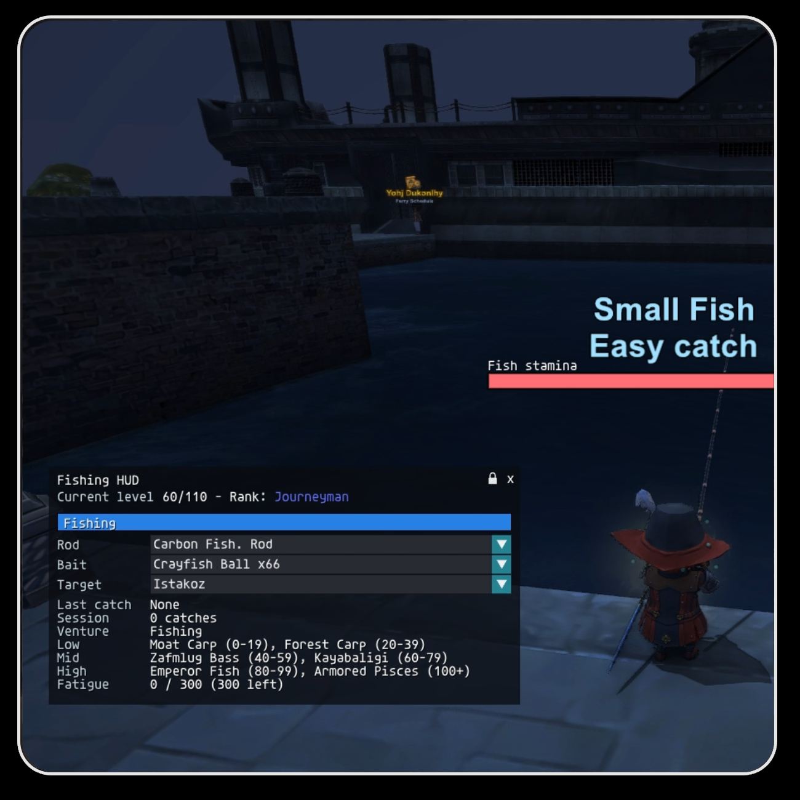
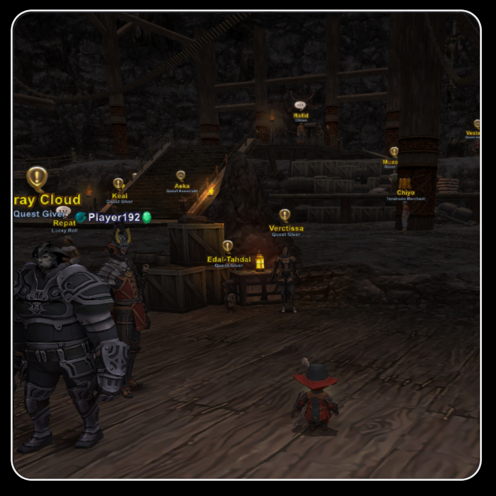
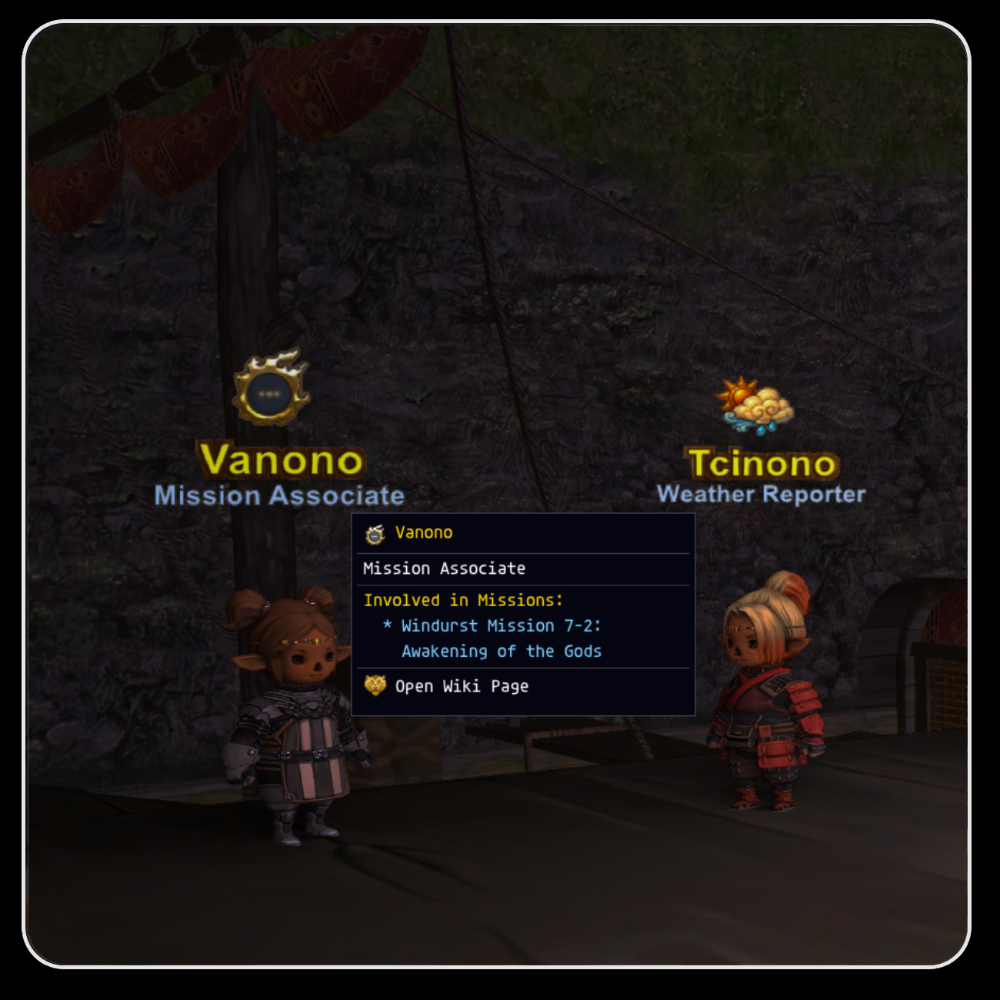
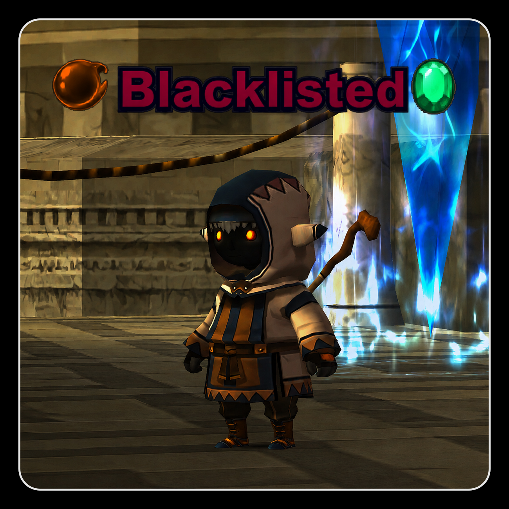
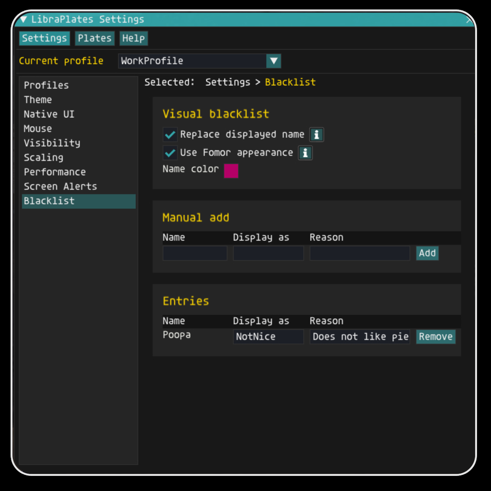

# LibraPlates

Clickable, customizable nameplates and quality-of-life tools for Final Fantasy XI.

LibraPlates is an Ashita addon built for the CatseyeXI private server, with many features that should also work on other FFXI servers. It adds clickable nameplates, NPC/object info, combat helpers, and CatseyeXI-focused quality-of-life tools.

> Status: active work in progress. Expect ongoing polish, data fixes, and feature tuning.

<a href="docs/screenshots/features/main.png">
  
</a>

## Key features

- **Clickable nameplates** — click plates to target, inspect, open menus, attack, gather, travel, and use supported Catseye systems faster.
- **Right-click combat** — right-click enemy plates to start attacking, including automatic dismount handling.
- **Right-click gathering** — use Pickaxes, Hatchets, and Sickles directly on supported gathering points.
- **NPCs and objects with real context** — icons, titles, service labels, quest info, mission info, and clickable wiki links.
- **CatseyeXI quality-of-life markers** — special Catseye NPCs, services, events, HELM, weekly hunts, Adept Reforging, Voidwatch, Ephemeral Box, and more.
- **Combat information on plates** — enemy behavior, detection, links, weaknesses, resists, immunities, buffs, debuffs, cast alerts, claim colors, and AOE helpers.
- **Plate stacking** — reduces messy overlap in crowded areas so names, bars, and icons stay readable.
- **Pet-class support** — special plates and helpers for BST, SMN, DRG, PUP, luopans, trusts, pet timers, maneuvers, avatar/spirit bars, and pet action alerts.
- **Current target bar** — static target display for enemies, NPCs, objects, PCs, trusts, pets, and self.
- **Screen alerts** — built-in and custom alerts with optional sounds and separate visual lanes.
- **Blacklist tools** — hide, rename, recolor, or replace blacklisted players, with quick-menu controls.
- **Streamer Mode** — replace local player names with safe labels like `Player1`, `Player2`, and similar.
- **Highly customizable** — profiles, fonts, colors, textures, icons, anchors, auto-stacking, scaling, visibility rules, and performance options.
- **Extra QoL modules** — resting tick/logout timer, fishing HUD, gathering tool count, crafting results, mount cooldown, blacklist tools, quick menus, and profile management.

## Feature gallery

Click any image to open it full-size.

| Combat | Combat details | Quick menu |
| --- | --- | --- |
| <a href="docs/screenshots/features/combat.png"></a> | <a href="docs/screenshots/features/combat2.png"></a> | <a href="docs/screenshots/features/quick.png"></a> |
| Clickable combat plates and enemy info. | More combat/readability tools. | Context menus for fast actions. |

| Catseye QoL | Teleport tools | Jeuno/NPC info |
| --- | --- | --- |
| <a href="docs/screenshots/features/catseye%20.png"></a> | <a href="docs/screenshots/features/Teleport.png"></a> | <a href="docs/screenshots/features/jeuno.png"></a> |
| Catseye systems, services, and markers. | Quick travel and teleport helpers. | NPC/object info with useful labels. |

| SMN pet frame | PUP automaton | DRG wyvern |
| --- | --- | --- |
| <a href="docs/screenshots/features/smn.png"></a> | <a href="docs/screenshots/features/pup_animation.gif"></a> | <a href="docs/screenshots/features/drg.png"></a> |
| Custom SMN avatar/spirit pet frame support. | Automaton frame, maneuvers, overload, and burden helpers. | Wyvern plate support and pet-class QoL. |

| Fishing | Norg services | Kazan / special NPCs |
| --- | --- | --- |
| <a href="docs/screenshots/features/fish.png"></a> | <a href="docs/screenshots/features/norg.png"></a> | <a href="docs/screenshots/features/kazan.png"></a> |
| Fishing HUD, catches, fatigue, and life-skill helpers. | Service NPCs with icons, titles, and quick context. | Special NPC markers and Catseye-specific data. |

| Blacklist | Blacklist settings | Settings UI |
| --- | --- | --- |
| <a href="docs/screenshots/features/blacklist.png"></a> | <a href="docs/screenshots/features/bl-settings.png"></a> | <a href="docs/screenshots/features/settings%20(1).png"></a> |
| Privacy and blacklist tools. | Simple blacklist controls. | Live preview and profile/settings management. |

## What LibraPlates does

### Clickable nameplates

This is one of the biggest differences from a normal nameplate addon: LibraPlates plates are not just labels.

- Left-click plates to target directly instead of cycling through targets.
- Right-click enemies to start combat.
- Right-click gathering points to use the correct tool.
- Right-click players, self, trusts, NPCs, and objects to open supported quick actions.
- Open teleport, Mog House exit, Ephemeral Box, blacklist, mount, job-change, and Catseye service actions from contextual menus.
- Use plate information before clicking: icon, title, distance, type, behavior, quest/mission role, or service category.

### Nameplates

LibraPlates can show different plate layouts for different entity types and situations.

- Self, PC, enemy, trust, BST pet, SMN avatar/spirit, DRG wyvern, PUP automaton, luopan, NPC, and object plates.
- Name, background, HP/MP/TP bars, cast bars, job, level, ID, distance, target markers, type lines, icons, buffs, and debuffs.
- Anchoring and auto-stacking so widgets can attach to the plate, name, HP bar, or another widget.
- Per-entity styling for fonts, colors, outlines, textures, bar warnings, opacity, scale, and distance behavior.
- Plate stacking and screen clamping helpers to reduce overlap.

### Current target bar

A static target bar for whatever you are targeting: enemies, NPCs, objects, PCs, trusts, pets, and self.

- Name, distance, HP percent, and optional mob/status information.
- Smooth HP movement.
- Damage prediction.
- Healing prediction where data is available.
- Enemy status icons, weaknesses, resists, detects, links, and behavior indicators.
- Reuses LibraPlates plate colors/styles so it feels like part of the same UI.

### Enemy awareness

Enemy plates are built to reduce the “what am I looking at?” tax during combat.

- Claim colors for unclaimed, party claim, other claim, and call-for-help states.
- Mob info icons for aggression/passive behavior, detection methods, links, special traits, weaknesses, resists, and immunities.
- Cast bars and alerts for dangerous enemy magic or readied abilities.
- AOE range highlighting for supported actions.
- Enmity markers for enemies targeting you or allies.
- Peer Inspector details for deeper enemy information.

### NPC and object data

LibraPlates includes zone data for NPCs and objects so plates can be useful before clicking.

- Clear type lines such as vendor, quest giver, mission associate, survival guide, home point, event NPC, and Catseye service NPC.
- Icon categories for common NPC/object roles.
- Concise notes for important services.
- Quest and mission entries with clickable wiki links that open directly to the related wiki page where supported.
- Special Catseye markers for custom systems and NPCs.
- Object support for boxes, guides, books, doors, gathering points, and other interactables.

### Quick menu

Right-click supported plates for useful actions.

- Player actions: examine, follow, invite, request invite, party/alliance actions, Catseye profile, and blacklist.
- Self actions: accept/decline invite, leave party/alliance, mount/dismount, job favorites, and travel helpers.
- Trust actions: dismiss one trust, dismiss all trusts, and trust visibility helpers.
- Teleport helpers for supported Home Points, Survival Guides, Field Manuals, Mog House exits, and related systems.
- Ephemeral Box actions for storing, browsing, searching, favoriting, and extracting items.

### Job, mount, and travel helpers

- One-click job-change favorites at supported Moogles.
- Optional lockstyle, macro book, and macro page steps after job change.
- Main/sub job swap handling.
- Mount and random mount actions.
- Remount cooldown display.
- Mog House exit helpers where unlocked.

### Resting, fishing, gathering, and crafting

- Resting tick bar/ring and logout countdown helper.
- Fishing result display.
- Fishing HUD for stamina/readiness, recent catches, rod, bait, target, fatigue, and Catseye fishing ventures where supported.
- Right-click fishing when a rod is equipped.
- Gathering tool display and one-click mining, excavation, logging, and harvesting.
- Crafting result display for NQ, HQ, and breaks.

### Buffs, debuffs, pets, and luopans

- Self, party/player, trust, enemy, pet, and luopan status icons.
- Trust buff/debuff tracking.
- PUP maneuvers.
- BST charm timer, pet state, Sic, Ready, and Reward helpers.
- SMN Ward/Rage helpers, avatar/spirit plates, detached frames, and cast bars where available.
- DRG wyvern support and breath alerts.

### Alerts and diagnostics

- On-screen alerts with optional sounds.
- Enemy spell/readied action alerts.
- Pet action alerts.
- Custom text alerts.
- Built-in alert categories for common CatseyeXI and FFXI event flows.
- Performance monitor, reports, FPS/adaptive modes, diagnostic captures, and lag testing tools.

### Privacy and player controls

- Blacklist players from commands or quick menus.
- Mirror native blacklist add/remove commands.
- Add blacklist reasons.
- Replace blacklisted player names or colors.
- Optional blacklisted player model replacement.
- Streamer Mode can anonymize local player names with safe labels.

## Settings and profiles

Open settings with:

```txt
/lp config
```

The settings UI is split into:

- `Settings` — profiles, fonts, native UI, mouse behavior, scaling, visibility, performance, and global options.
- `Plates` — visual setup per entity and plate state.
- `Help` — user guide, setting search, and troubleshooting.

Profile features:

- Create, copy, rename, delete, reset, and switch profiles.
- Auto-switch profiles by job assignment.
- Per-character profile storage.
- Automatic backups before destructive profile actions.

## Installation

1. Place the `LibraPlates` folder in your Ashita addons folder:

   ```txt
   Ashita/addons/LibraPlates
   ```

2. Load the addon:

   ```txt
   /addon load LibraPlates
   ```

3. Open settings:

   ```txt
   /lp config
   ```

## Useful commands

```txt
/lp config          Open settings
/lp reload          Reload settings/data
/lp perf on         Show performance monitor
/lp perf report     Save a performance report
```

Most normal setup should happen through the settings window instead of commands.

## Performance notes

LibraPlates does a lot for an older game client, so performance is treated as a feature.

- Adaptive performance mode can reduce background work when FPS drops.
- Nameplate updates are split into critical, medium, and static refresh work.
- Important plates stay prioritized: self, target, subtarget, tactical, engaged, casting, hovered, and important enemies.
- NPC/object info is loaded per zone.
- Textures and generated plates are cached.
- Distant or expensive plate features can be reduced through settings.

## Suggested README image order

If you only want to make a few images first, make these:

1. `hero-target-bar-and-plates.png`
2. `enemy-mob-info.png`
3. `npc-object-info.png`
4. `settings-preview.png`
5. `quick-menu.png`

That gives the page a strong first impression without needing screenshots for every subsystem.

## Credits

LibraPlates is a love-of-the-game project by Lunem.

Special thanks to the Ashita community, including atom0s and Thorny, and to public addon authors whose shared work helped guide parts of LibraPlates.

Feedback, corrections, bug reports, missing NPC/object data, and UI polish suggestions are welcome.
